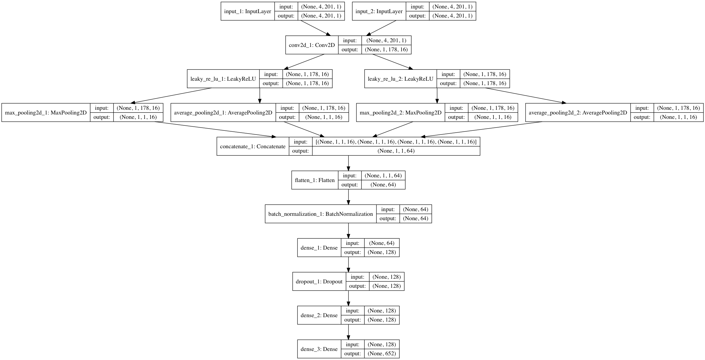
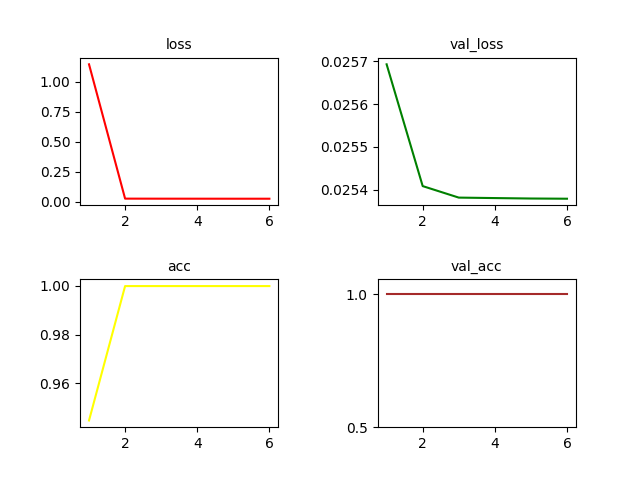

# SeqConv
# Sequence Convolution

###### The goal is to predict the binding intensity of a specific transcription factor only based on DNA sequence information of the binding region by means of convolutional neural network. Below is an overview of the strcture. Simplified version provided by Shen Wei.

 ***
##### Here, we provide a file named 'total.f.n.t.txt' recording 30392 binding intensities after max-min scaling followed by 201-bp DNA sequences. Below is an example:

    
    0.999079792677  TTCCGGTGGAATGGTTTGGTAAGGTTTCCTAAAAGCTTATGGAATCTAAAAGCTCTGCAAACAATATAAATATCAATTAGTGATACTTTTACACTGAGAATCTGATCCGACCGTTACAGTTACGCATATATATTATACACTGAATATTTTATTATAATTCATGTTACTTTTCTTTTGTTATATGTTTGATTTTTTCTTGTT
    0.754575886015  GCATCCACTAGAACGCGTAGATCGTTGTCACCTAACTGCGAATTCACACCCGATCTTAAGTCGTTGATCATTCTTTGATGTTCTTCCTTCCAACGTGTATATTCCAATTCAAATGAAAAGACACCTACAACATCAAAACCAACTTCATTCTTAGTAAAAGATCACAAAGAGTCAAGAAGTGTTATGTGAGATTCTGAAAGT
    0.585134701741  TTTTGTTTAAATCGTCTTTTAATATATTTTGGATCTTGTAAGTTTTGTTTTTGTAAGCCTAGGTGAGATCTGGATTCTAAATCTATTACCGAAAACAGAATCTTTGAAAGTGGATCAACGTGTCCATAAATTTGGTAGCGATGCATATATTATAAATCTAAATACTGTAGGATACAATTTGACACGTAATGTATTGGTGAA

##### import modules

    
    import pandas as pd
    import numpy as np
    from sklearn.model_selection import train_test_split
    import matplotlib.pyplot as plt

##### Define functions to transfer DNA sequence (both '+' and '-' strand) to one-hot matrix and prepare data for convolutional neural network

    def Seq2mat(seq):
	    mat1 = np.zeros([4,len(seq)])
	    mat2 = np.zeros([4,len(seq)])
	    for letter,index in zip(seq,range(len(seq))):
		if letter == 'A':
		    mat1[0,index] = 1
		    mat2[3,len(seq)-index-1]=1
	        if letter == 'C':
		    mat1[1,index] = 1
		    mat2[2,len(seq)-index-1]=1
		if letter == 'G':
		    mat1[2,index] = 1
	    	    mat2[1,len(seq)-index-1]=1
	    	if letter == 'T':
		    mat1[3,index] = 1
	    	    mat2[0,len(seq)-index-1]=1
		if letter == 'N':
		    pass
	    return mat1,mat2

    def mat2Mat(filename):
	    Mat = []
	    Tag = []
	    with open(filename) as f:
		for line in f.readlines():
	            tag = line.split()[0]
		    seq = line.split()[1]
		    mat1,mat2 = Seq2mat(seq)
		    Mat.append([mat1,mat2])
		    Tag=np.append(Tag,float(tag))
	    return np.array(Mat),Tag

    Mat,Tag = mat2Mat('total.f.n.t.txt')
    
    from keras.utils import np_utils
    from collections import Counter
    
    x_train,x_test,y_train,y_test=train_test_split(Mat,Tag,test_size=0.15,random_state=12580)
    x_train_1 = x_train[:,0,:,:]
    x_train_1 = x_train_1.reshape(x_train_1.shape[0],4,201,1)
    x_train_2 = x_train[:,1,:,:]
    x_train_2 = x_train_2.reshape(x_train_2.shape[0],4,201,1)

    x_test_1 = x_test[:,0,:,:]
    x_test_1 = x_test_1.reshape(x_test_1.shape[0],4,201,1)
    x_test_2 = x_test[:,1,:,:]
    x_test_2 = x_test_2.reshape(x_test_2.shape[0],4,201,1)

    y_train = np_utils.to_categorical(y_train,num_classes=len(Counter(Tag)))
    y_test = np_utils.to_categorical(y_test,num_classes=len(Counter(Tag)))

##### Now build the frame of network and train model

    from keras.models import Model
    from keras.layers import Input,Dense,Dropout,Flatten
    from keras.layers import Convolution2D,MaxPooling2D,AveragePooling2D
    from keras.layers.normalization import BatchNormalization
    from keras.layers.advanced_activations import LeakyReLU
    from keras.utils import plot_model
    from keras.callbacks import EarlyStopping
    from keras.layers import concatenate
    from keras.initializers import random_normal
    from keras import regularizers
    
    mat_1 = Input(shape=(4,201,1))
    mat_2 = Input(shape=(4,201,1))
    
    shared_conv = Convolution2D(filters=16,kernel_size=(4,24),padding='valid')
    
    x1 = shared_conv(mat_1)
    x2 = shared_conv(mat_2)
    
    x1 = LeakyReLU()(x1)
    x2 = LeakyReLU()(x2)
    
    x1_1 = MaxPooling2D(pool_size=(1,178))(x1) 
    x1_2 = AveragePooling2D(pool_size=(1,178))(x1)
    
    x2_1 = MaxPooling2D(pool_size=(1,178))(x2)
    x2_2 = AveragePooling2D(pool_size=(1,178))(x2)
    
    merged_vector = concatenate([x1_1,x1_2,x2_1,x2_2])
    
    x = Flatten()(merged_vector)
    x = BatchNormalization()(x)
    x = Dense(128,kernel_initializer=random_normal(mean=0,stddev=0.02),bias_initializer=random_normal(mean=0,stddev=0.02))(x)
    x = Dropout(0.5)(x)
    x = Dense(128,kernel_initializer=random_normal(mean=0,stddev=0.02),bias_initializer=random_normal(mean=0,stddev=0.02))(x)
    main_output = Dense(len(Counter(Tag)),activation='softmax',activity_regularizer=regularizers.l2(10e-5),kernel_initializer=random_normal(mean=0,stddev=0.02),bias_initializer=random_normal(mean=0,stddev=0.02))(x)
    
    model = Model(inputs=[mat_1,mat_2],outputs=main_output)
    model.compile(loss='categorical_crossentropy',optimizer='adadelta',metrics=['accuracy'])
    early_stopping = EarlyStopping(monitor='val_acc',patience=5)
    history = model.fit([x_train_1,x_train_2],y_train,batch_size=256,epochs=10,validation_data=[[x_test_1,x_test_2],y_test],callbacks=[early_stopping])
 
 ##### Show result and save model
    
    score = model.evaluate([x_test_1,x_test_2],y_test)
    print 'Test score:',score[0]
    print 'Test accuracy',score[1]
    loss = history.history['loss']
    val_loss = history.history['val_loss']
    acc = history.history['acc']
    val_acc = history.history['val_acc']
    
    plt.figure()
    plt.subplots_adjust(wspace=0.5,hspace=0.5)
    plt.subplot(2,2,1)
    plt.plot(range(1,len(loss)+1),loss,color='red')
    plt.title('loss',fontsize=10)
    plt.subplot(2,2,2)
    plt.plot(range(1,len(val_loss)+1),val_loss,color='green')
    plt.title('val_loss',fontsize=10)
    plt.subplot(2,2,3)
    plt.plot(range(1,len(acc)+1),acc,color='yellow')
    plt.title('acc',fontsize=10)
    plt.subplot(2,2,4)
    plt.plot(range(1,len(val_acc)+1),val_acc,color='brown')
    plt.title('val_acc',fontsize=10)
    plt.yticks([0.5,1])
    plt.show()

    plot_model(model,to_file='model_SeqConv.png',show_shapes=True)
    model.save('SeqConv_model.h5')
